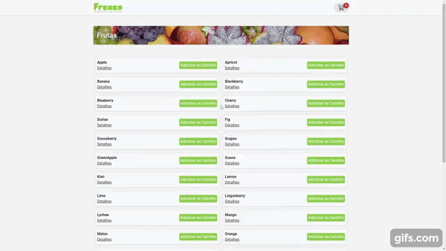
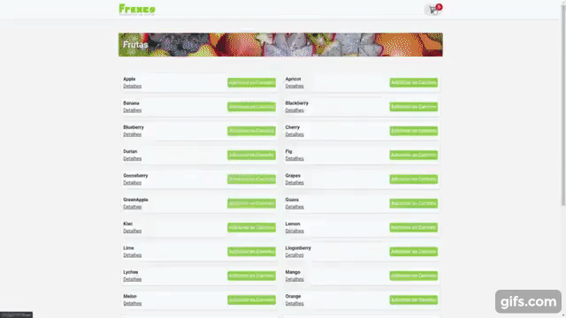
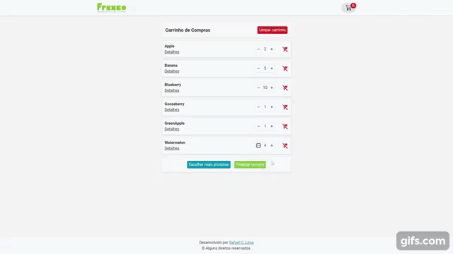

<h1 align="center">
  
</h1>

<h1 align="center">
    Apresentação do projeto
</h1>

<h1 align="center">
    
</h1>

<h1 align="center">
    
</h1>

<h1 align="center">
    
</h1>


## ⚠️ Importante

Caso os dados da API não carreguem, ultilizar a extensão [Moesif Origin & CORS Changer](https://chrome.google.com/webstore/detail/moesif-origin-cors-change/digfbfaphojjndkpccljibejjbppifbc) em seu navegador, de preferencia no Google Chrome. Desativar extensão após o uso.


---

## 🚀 Tecnologias utilizadas

O projeto foi desenvolvido utilizando as seguintes tecnologias

- [ReactJS](https://reactjs.org)
- [TailwindCSS](https://tailwindcss.com/)
- [Axios](https://github.com/axios/axios)
- [React-toastify](https://fkhadra.github.io/react-toastify/introduction)
- [React icons](https://react-icons.github.io/react-icons/)

---

## 🗂 Como baixar o projeto

```bash

    # Clonar o repositório
    $ git clone https://github.com/DevRafael-GL/frexco-challenge

    # Entrar no diretório
    $ cd frexco-challenge

    # Instalar as dependências
    $ npm install

    # Iniciar o projeto
    $ npm run dev
```

---

Desenvolvido 💜 por Rafael Gonçalves Lima
